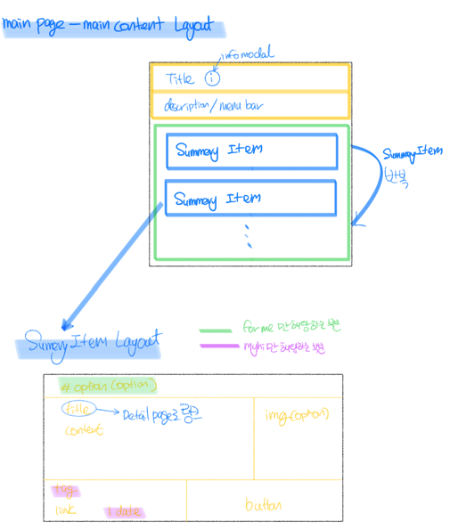

## Project Link

You can try the project.
Project Link: <https://liner-clone-b399a.web.app/>

# Liner Clone

## Technologies

- REACT
- SASS(SCSS)

## 기본적인 구조

- 고정된 Header, Left Nav 는 먼저 따로 고정했습니다.
- 변화되는 부분인 Main Content 영역과 Right menu 영역을 구분했습니다.
- Main Content 부분도 Summery Page(MyHi page, Foryou page) or Detail Page(Foryou Detail page, MyHi detail page, Recommand detail page)에 따라 공통된 레이 아웃이 있어 이를 구분했습니다.

  - Summary Page 는 SummaryItem 을 기본 레이아웃으로 사용했습니다.
  - Detail Page 는 DetailCommon 을 기본 레이아웃으로 사용했습니다.
  - 버튼들은 Buttons 에 모아 import 해서 사용했습니다.

### 전체적인 그림은 아래 그림으로 설명했습니다.

  
  
  
  
  
  

## Setup

To run this project, install it locally using npm:

1. Clone the repo

```bash
git clone https://github.com/Globalkmaria/liner.git
```

2. Go into the folder

```bash
cd liner
```

3. Install NPM packages

```bash
npm i
```

4. Start server

```bash
npm start
```

## Inspiration

[Liner Webpage](https://getliner.com/)
